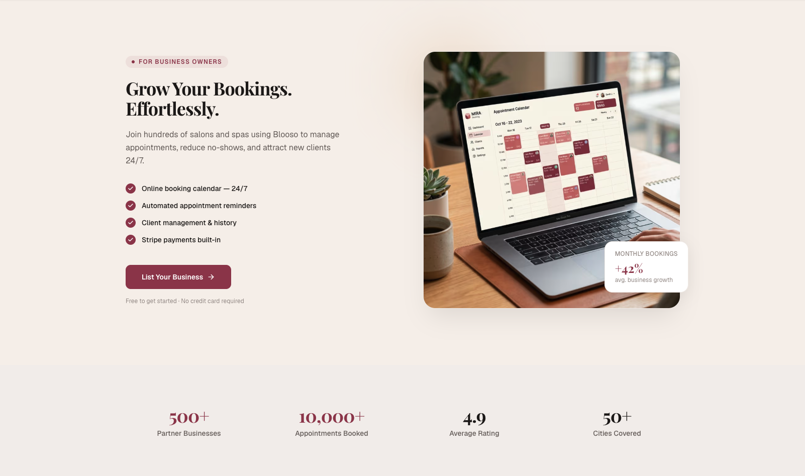

# Blooso

Premium booking platform for beauty & wellness businesses. Book appointments 24/7.

**[Live Demo →](https://blooso.pasindulanka.me/)**


### For Businesses



> **Note:** This is a demo deployment for portfolio and resume purposes only.

## Tech Stack

- **Monorepo**: Turborepo
- **API**: NestJS 11, Prisma, PostgreSQL, Redis, Stripe, Resend
- **Web**: Next.js 16, React 19, Tailwind CSS, shadcn/ui, Recharts
- **Shared**: TypeScript, Zod, path aliases

## Prerequisites

- Node.js 18+
- Docker (for PostgreSQL and Redis)
- npm 10+

## Quick Start

### 1. Clone and install

```bash
git clone <repo-url>
cd blooso
npm install
```

### 2. Environment

Copy example env files and fill in values:

```bash
cp apps/api/.env.example apps/api/.env
cp apps/web/.env.example apps/web/.env
```

Required for API: `DATABASE_URL`, `JWT_SECRET`, `REDIS_URL`, `STRIPE_SECRET_KEY`, `STRIPE_WEBHOOK_SECRET`, `RESEND_API_KEY`

Required for Web: `NEXT_PUBLIC_API_URL` (e.g. `http://localhost:3001`)

### 3. Database

```bash
# Start Postgres and Redis
docker compose up -d

# Run migrations
npm run db:migrate

# Seed (creates admin user)
npm run db:seed
```

### 4. Run

```bash
npm run dev
```

- Web: http://localhost:3000
- API: http://localhost:3001
- API docs: http://localhost:3001/api/docs

## Scripts

| Command              | Description                 |
| -------------------- | --------------------------- |
| `npm run dev`        | Start both apps in dev mode |
| `npm run build`      | Build all apps              |
| `npm run db:migrate` | Run Prisma migrations       |
| `npm run db:push`    | Push schema (dev)           |
| `npm run db:seed`    | Seed database               |
| `npm run db:studio`  | Open Prisma Studio          |

## Project Structure

```
blooso/
├── apps/
│   ├── api/          # NestJS API
│   ├── web/          # Next.js web app
│   └── docs/         # Documentation
├── packages/
│   ├── shared/       # Shared types and utils
│   ├── tailwind-config/
│   └── ui/
└── package.json
```

## Deployment

### API (Railway)

1. Create a Railway project
2. Add PostgreSQL and Redis (or use Neon + Upstash)
3. Connect repo, set root directory to `apps/api`
4. Set env vars: `DATABASE_URL`, `JWT_SECRET`, `REDIS_URL`, `STRIPE_*`, `RESEND_*`, `CORS_ORIGIN`
5. Deploy

### Web (Vercel)

1. Import project in Vercel
2. Set root directory to `apps/web`
3. Set `NEXT_PUBLIC_API_URL` to your API URL
4. Deploy

### Production seed

```bash
cd apps/api
DATABASE_URL="postgresql://..." npx ts-node prisma/seed-production.ts
```

## Default Credentials

- **Admin** (dev seed): admin@blooso.com / Admin123!
- **Demo** (production seed): demo@blooso.com / Demo123!

## License

Private / Unlicensed
